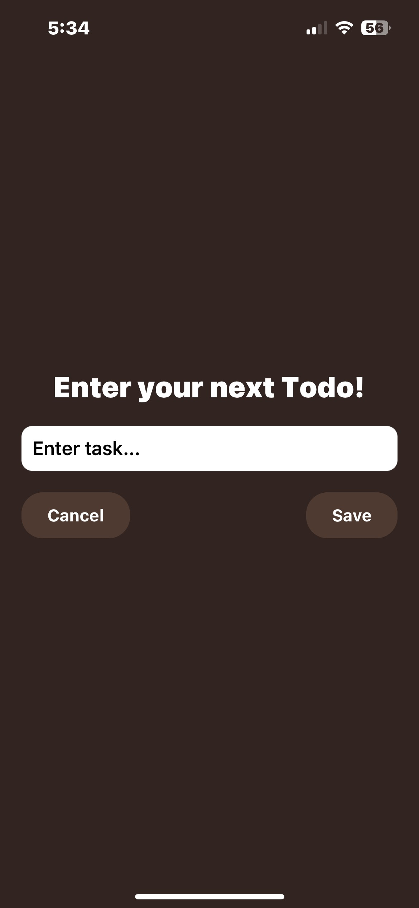

# 📝 To-Do List App

A sleek, modern, and intuitive To-Do List app built with **React Native**, **Zustand**, and **React Native Paper**. It features local persistence using **AsyncStorage**, swipe-to-delete, edit functionality, and full-screen modals for task management.

---

## 📱 Features

- Add, edit, and delete to-dos effortlessly
- Beautiful UI using React Native Paper
- Swipe to delete a task with visual feedback
- Persistent storage with AsyncStorage
- Full-screen modals for adding/editing tasks
- Date & time stamp on each to-do
- Responsive, mobile-friendly layout

---

## 🧠 Tech Stack

- **React Native**
- **React Native Paper**
- **Zustand** (for state management)
- **AsyncStorage** (for local persistence)
- **SwipeListView** (for swipe-to-delete)
- **Expo**

---

## 📸 App Screenshots

| Home Screen | Adding a Todo | Swiped Todo |
|-------------|----------------|--------------|
|  |  |  |

> 💡 To add your own screenshots, place them in a `showcase/` folder and update the paths accordingly.

---

## 🚀 Getting Started

```bash
# Clone the repository
git clone https://github.com/YOUR_USERNAME/todo-app.git
cd todo-app

# Install dependencies
npm install

# Run on Expo
npx expo start
